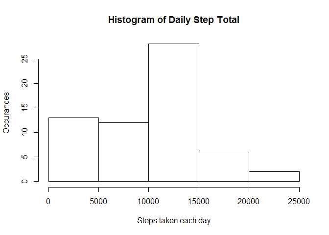
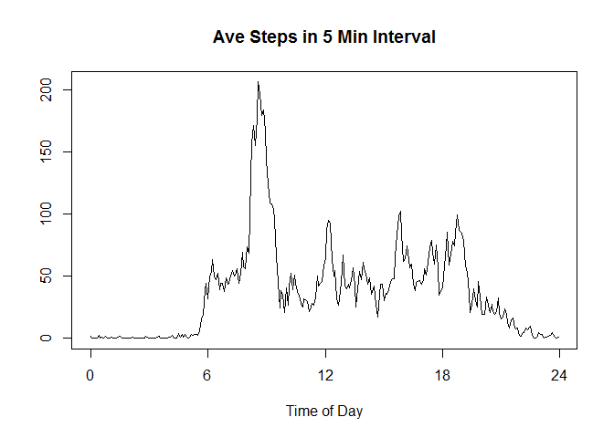
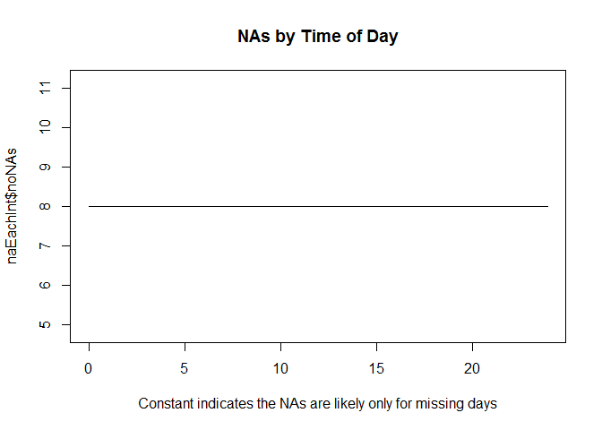
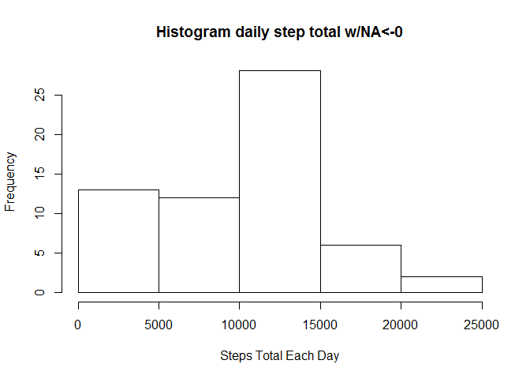
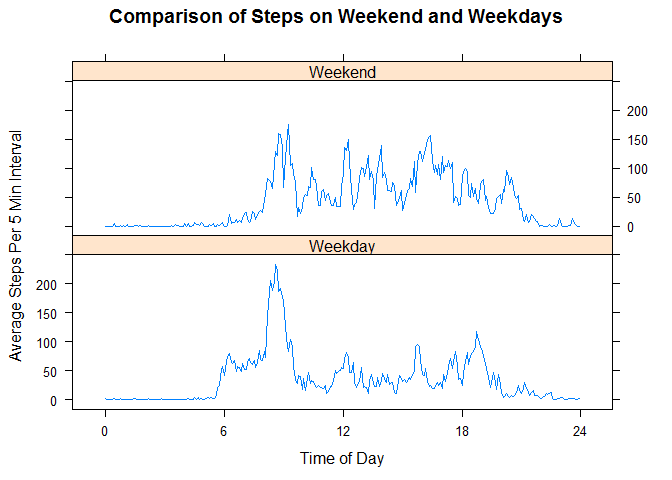

# Reproducible Research: Peer Assessment 1
Alan Chudnow  
Wednesday, April 15, 2015  


## Loading and preprocessing the data

* The code below will unzip and read in the file.

* A review of the data indicates that pre-processing is not required to support this exercize.


```r
fzip <- "activity.zip"
unzip(fzip,list=TRUE)
```

```
##           Name Length                Date
## 1 activity.csv 350829 2014-02-11 10:08:00
```

```r
#unzip(fzip)  #This is commented out to avoid unzipping over and over

fcsv <- "activity.csv"
df <- read.csv(fcsv)
```


## 1. What is mean total number of steps taken per day?


For this part of the assignment,  ignore the missing values in the dataset.

### 1.1 Calculate the total number of steps taken per day


```r
stepsEachDay <- aggregate(df$steps, by=list(date=df$date),FUN=sum,na.rm=TRUE)
names(stepsEachDay) = c("date","totalSteps")
stepsEachDay
```

```
##          date totalSteps
## 1  2012-10-01          0
## 2  2012-10-02        126
## 3  2012-10-03      11352
## 4  2012-10-04      12116
## 5  2012-10-05      13294
## 6  2012-10-06      15420
## 7  2012-10-07      11015
## 8  2012-10-08          0
## 9  2012-10-09      12811
## 10 2012-10-10       9900
## 11 2012-10-11      10304
## 12 2012-10-12      17382
## 13 2012-10-13      12426
## 14 2012-10-14      15098
## 15 2012-10-15      10139
## 16 2012-10-16      15084
## 17 2012-10-17      13452
## 18 2012-10-18      10056
## 19 2012-10-19      11829
## 20 2012-10-20      10395
## 21 2012-10-21       8821
## 22 2012-10-22      13460
## 23 2012-10-23       8918
## 24 2012-10-24       8355
## 25 2012-10-25       2492
## 26 2012-10-26       6778
## 27 2012-10-27      10119
## 28 2012-10-28      11458
## 29 2012-10-29       5018
## 30 2012-10-30       9819
## 31 2012-10-31      15414
## 32 2012-11-01          0
## 33 2012-11-02      10600
## 34 2012-11-03      10571
## 35 2012-11-04          0
## 36 2012-11-05      10439
## 37 2012-11-06       8334
## 38 2012-11-07      12883
## 39 2012-11-08       3219
## 40 2012-11-09          0
## 41 2012-11-10          0
## 42 2012-11-11      12608
## 43 2012-11-12      10765
## 44 2012-11-13       7336
## 45 2012-11-14          0
## 46 2012-11-15         41
## 47 2012-11-16       5441
## 48 2012-11-17      14339
## 49 2012-11-18      15110
## 50 2012-11-19       8841
## 51 2012-11-20       4472
## 52 2012-11-21      12787
## 53 2012-11-22      20427
## 54 2012-11-23      21194
## 55 2012-11-24      14478
## 56 2012-11-25      11834
## 57 2012-11-26      11162
## 58 2012-11-27      13646
## 59 2012-11-28      10183
## 60 2012-11-29       7047
## 61 2012-11-30          0
```

### 1.2 Histogram of the total number of steps taken each day


```r
hist(stepsEachDay$totalSteps, main="Histogram of Daily Step Total",
     xlab = "Steps taken each day",
     ylab = "Occurances")
```

 

### 1.3 Mean and median of the total number of steps taken per day


```r
meanStepsPerDay <- mean(stepsEachDay$totalSteps, na.rm=TRUE)
medianStepsPerDay <- median(stepsEachDay$totalSteps, na.rm=TRUE)
meanStepsPerDay
```

```
## [1] 9354.23
```

```r
medianStepsPerDay
```

```
## [1] 10395
```
The mean is 9354.2295082.  The median is 10395.


## 2. What is the average daily activity pattern?

### 2.1 Time series plot of the 5-minute interval vs. the average number of steps taken, averaged across all days


Time series plot of the 5-minute interval (x-axis) and the average number of steps taken, averaged across all days (y-axis)  (i.e. type = "l") 


```r
stepsEachInt <- aggregate(df$steps, by=list(interval=df$interval), 
                          FUN=mean, na.rm=TRUE)

#Label and add some new colums to help understand data
names(stepsEachInt) = c("interval","meanSteps")

stepsEachInt$hour <- stepsEachInt$interval %/% 100 
stepsEachInt$min  <- stepsEachInt$interval %% 100
stepsEachInt$plotHour <- stepsEachInt$hour + stepsEachInt$min/60

#Plot
plot(stepsEachInt$plotHour, stepsEachInt$meanSteps, 
     main="Ave Steps in 5 Min Interval",
     xlab = "Time of Day", ylab = "", type="l",
     xaxt='n')

axis(side=1, at=seq(0,24, by=6))
```

 

```r
maxInt <- stepsEachInt[which.max(stepsEachInt$meanSteps),]
```

### 2.2 Which 5-minute interval, on average across all the days in the dataset, contains the maximum number of steps?


```r
maxInt <- stepsEachInt[which.max(stepsEachInt$meanSteps),]
maxInt[]
```

```
##     interval meanSteps hour min plotHour
## 104      835  206.1698    8  35 8.583333
```

The 5-minute interval that contains the greatest average number of steps is 835.


## 3. Imputing missing values

### 3.1 Total number of missing values in the dataset (i.e. the total number of rows with NAs)


```r
#1
totalNA <- sum(is.na(df$steps))
totalNA
```

```
## [1] 2304
```
The total number of missing values is  2304.


### 3.2 Strategy for missing values

Devise a strategy for filling in all of the missing values in the dataset. The strategy does not need to be sophisticated. For example, you could use the mean/median for that day, or the mean for that 5-minute interval, etc.

My approach to this is:

* Make a table with only NAs

* Create a plot with NAs to see if there are any time dependencies. (See below)

* Note: At all times there are exactly 8 NAs.  This leads me to think that NAs occur only on certain days.  What are they?

* Yes. It looks like all NAs occur on 8 specific day as indicated by unique. 

* And on each of these NA days, the whole day is NA.

* So the best strategy is to fill these days with zero. Or ignore them.


```r
dfNA <- df[is.na(df$steps),]   #NA Only 
naEachInt <- aggregate(dfNA$interval, by=list(interval=dfNA$interval), FUN=length)
names(naEachInt) = c("interval","noNAs")

naEachInt$hour <- stepsEachInt$interval %/% 100 
naEachInt$min  <- stepsEachInt$interval %% 100
naEachInt$plotHour <- naEachInt$hour + naEachInt$min/60

plot(naEachInt$plotHour, naEachInt$noNAs, main="NAs by Time of Day", type="l",
     xlab="Constant indicates the NAs are likely only for missing days")
```

 

```r
table(naEachInt$noNAs)
```

```
## 
##   8 
## 288
```

```r
unique(dfNA$date)
```

```
## [1] 2012-10-01 2012-10-08 2012-11-01 2012-11-04 2012-11-09 2012-11-10
## [7] 2012-11-14 2012-11-30
## 61 Levels: 2012-10-01 2012-10-02 2012-10-03 2012-10-04 ... 2012-11-30
```

```r
naEachDay <- aggregate(dfNA$interval, by=list(date=dfNA$date),FUN=length)
naEachDay
```

```
##         date   x
## 1 2012-10-01 288
## 2 2012-10-08 288
## 3 2012-11-01 288
## 4 2012-11-04 288
## 5 2012-11-09 288
## 6 2012-11-10 288
## 7 2012-11-14 288
## 8 2012-11-30 288
```
Note: 

* I have 8 days that contain all the NAs

* Each of the 8 days in NA from 00:00 to 23:55

* It doesn't seem appropriate to add fill in NA with data from around the NA in time, because the whole day is blank.

* It doesn't seem appropriate to add in steps for a whole day not recorded, as that rewards the user for not using his tracking device.

* The best strategy seems to fill with zeros


### 3.3 Create a new dataset that is equal to the original dataset but with the missing data filled in.


```r
dfNAR <- df
dfNAR$steps[is.na(df$steps)] <- 0
```


### 3.4 Make a histogram of the total number of steps taken each day 


```r
stepsEachDayNAR <- aggregate(dfNAR$steps, by=list(date=dfNAR$date),FUN=sum)

names(stepsEachDayNAR) = c("date","totalSteps")

hist(stepsEachDayNAR$totalSteps, xlab = "Steps Total Each Day",
     main="Histogram daily step total w/NA<-0")
```

 

### 3.5 Calculate and report the mean and median total number of steps taken per day


```r
meanStepsPerDayNAR <- mean(stepsEachDayNAR$totalSteps)
medianStepsPerDayNAR <- median(stepsEachDayNAR$totalSteps)
```
The mean is 9354.2295082.  The median is 1.0395\times 10^{4}.


### 3.6 Do these values differ from the estimates from the first part of the assignment? 


```r
meanStepsPerDayNAR - meanStepsPerDay
```

```
## [1] 0
```

```r
medianStepsPerDayNAR - medianStepsPerDay
```

```
## [1] 0
```

No.  Because the original method reported a sum of zero for days that were completely NA as well.  


### 3.7 What is the impact of imputing missing data on the estimates of the total daily number of steps?

No impact 


## 4. Are there differences in activity patterns between weekdays and weekends?


### 4.1 Create a new factor variable in the dataset with two levels - "weekday" and "weekend" indicating whether a given date is a weekday or weekend day.

We extend as follows

* df$day will be the day of the week

* df$we will be true if the day of week is a weekend.


```r
df$day <- weekdays(as.Date(df$date))
df$we <- df$day=="Saturday" | df$day=="Sunday"

table(df$day)
```

```
## 
##    Friday    Monday  Saturday    Sunday  Thursday   Tuesday Wednesday 
##      2592      2592      2304      2304      2592      2592      2592
```

```r
table(df$we)
```

```
## 
## FALSE  TRUE 
## 12960  4608
```


### 4.2 Panel Plot comparing Weekday and Weekday activity

Make a panel plot containing a time series plot (i.e. type = "l") of the 5-minute interval (x-axis) and the average number of steps taken, averaged across all weekday days or weekend days (y-axis). See the README file in the GitHub repository to see an example of what this plot should look like using simulated data.


```r
stepsEachIntWD <- aggregate(df$steps[df$we == FALSE], 
                            by=list(interval=df$interval[df$we == FALSE]), 
                            FUN=mean, na.rm=TRUE)

names(stepsEachIntWD) = c("interval","weekday_Steps")
stepsEachIntWD$hour <- stepsEachIntWD$interval %/% 100 
stepsEachIntWD$min   <- stepsEachIntWD$interval %% 100
stepsEachIntWD$plotHour <- stepsEachIntWD$hour + stepsEachIntWD$min/60

stepsEachIntWE <- aggregate(df$steps[df$we == TRUE], 
                            by=list(interval=df$interval[df$we == TRUE]), 
                            FUN=mean, na.rm=TRUE)


names(stepsEachIntWE) = c("interval","weekend_Steps")
stepsEachIntWE$hour  <- stepsEachIntWE$interval %/% 100 
stepsEachIntWE$min   <- stepsEachIntWE$interval %% 100
stepsEachIntWE$plotHour <- stepsEachIntWE$hour + stepsEachIntWE$min/60

# plot(stepsEachIntWE$plotHour, stepsEachIntWE$weekend_Steps, 
#     main="Ave Steps in 5 min Interval",
#     xlab = "Hour of Day", ylab = "",type="n")
#
# lines(stepsEachIntWE$plotHour, stepsEachIntWE$weekend_Steps, 
#     col="blue",  type="l")
#
# lines(stepsEachIntWD$plotHour, stepsEachIntWD$weekday_Steps, 
#     col="green", type="l")
# text(3,140,label="Weekday",col="green")
# text(3,150,label="Weekend",col="blue")

library(lattice)
pDF <- data.frame(
      timeofday = c(stepsEachIntWE$plotHour,stepsEachIntWD$plotHour),
      steps = c(stepsEachIntWE$weekend_Steps,stepsEachIntWD$weekday_Steps),
      we =  c(rep("Weekend", length(stepsEachIntWE$plotHour)),
              rep("Weekday",length(stepsEachIntWD$plotHour))    )
      )

xyplot(steps ~ timeofday | we, data=pDF, layout=c(1,2), type="l", 
       xlab="Time of Day",ylab="Average Steps Per 5 Min Interval",
       main="Comparison of Steps on Weekend and Weekdays",
       scales=list(x=list(at=seq(0,24,6))))
```

 
